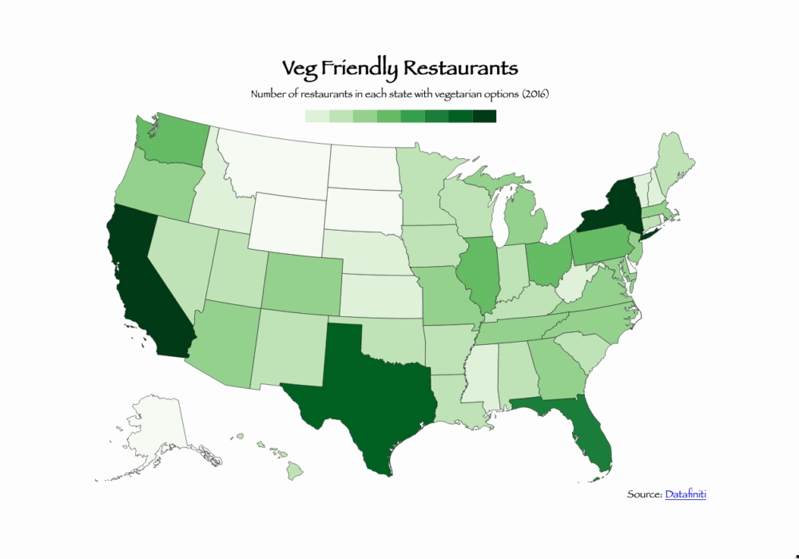

# veg
* Veg offers insight into the most veg-friendly areas of the United States.
* A choropleth map reflects the number of restaurants with veg options in each state

# technologies used
* Veg uses vanilla js, d3.js, topojson, html, and css.

# timeline

## day 1:
* research and data sourcing
* git repo and file structure
* mapping data points
* css styling

## bonus:
* mapping data for each county in the United States
