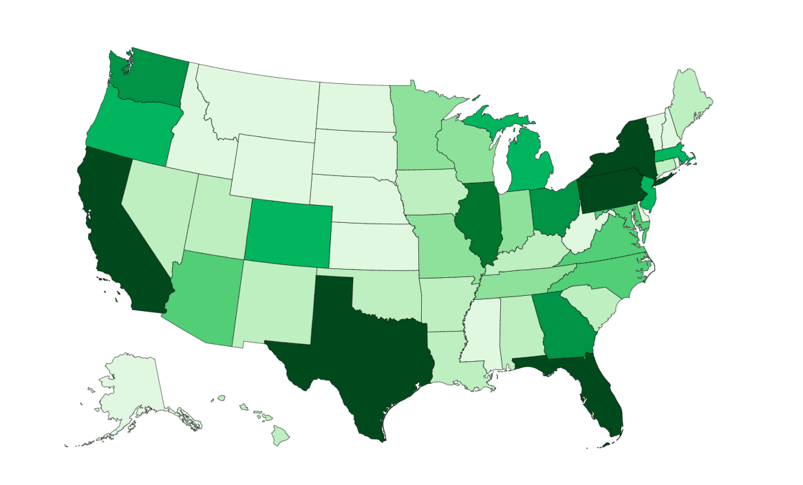

# veg

Proposal:
* Veg offers insight into the most veg-friendly areas of the United States.
* A choropleth map reflects the number of restaurants with veg options in each state

# technologies used
* Veg uses vanilla js, d3.js, topojson, html, and css.

# timeline
## day 1:
* research and data sourcing
* git repo and file structure

## day 2:
* using choropleth to accurately shade states based on number of veg friendly establishments

## day 3:
* css styling

## bonus:
* distance slider showing how many establishments within radius
